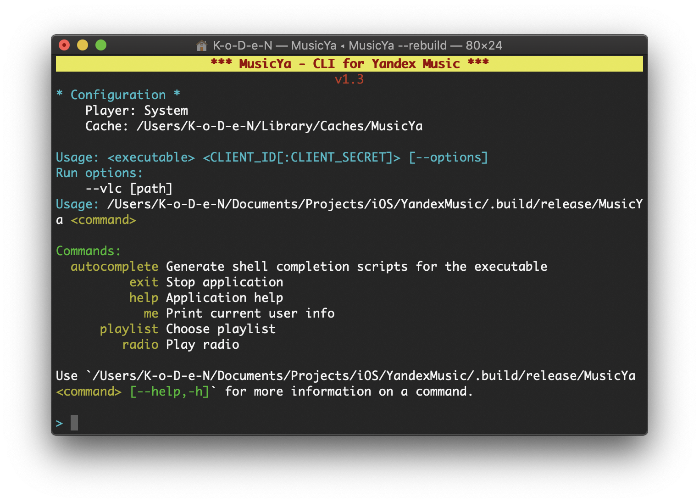
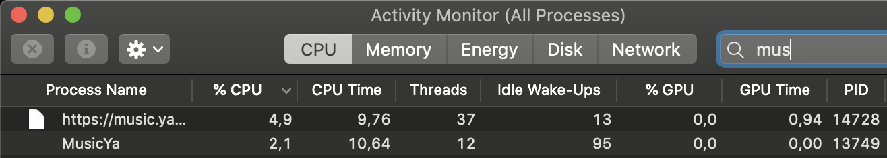
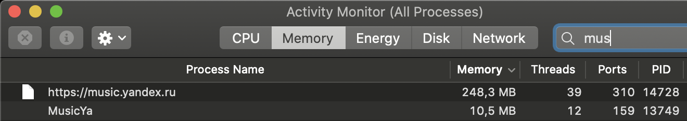

# YandexMusic

Partially implementation of Yandex Music API in Swift.

Thanks [MarshalX](https://github.com/MarshalX) for his [API Yandex Music](https://github.com/MarshalX/yandex-music-api) python library.

__SPM Dependency__

```
.package(url: "https://github.com/k-o-d-e-n/YandexMusic.git", from: "<%v%>")
```

### Application

Package also has simple console application to play your playlists and feed playlists.

<p align="center">
    
</p>

It will the best for my weak computer on Linux :)

__CPU__

<p align="center">
    
</p>

__Memory__

<p align="center">
    
</p>

__Usage__
    
    <executable> <CLIENT_ID[:CLIENT_SECRET]> [--options]

For example, `MusicYa 1a3b5c7d9e:0z8x6y4w2q --vlc`.

__Compile and run__

```
swift build
swift run
```

Or generate and run Xcode project `swift package generate-xcodeproj`.

### iOS, macCatalyst application

__Compile and run__

```
0. Open ./iOS/MusicYa/MusicYa.xcodeproj;
1. Replace 'your_client_id', 'your_secret' with your values in ./iOS/MusicYa/MusicYa/Application.swift file;
2. Run project.
```
